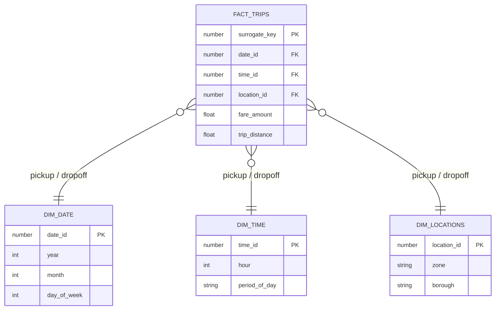

# 🏛️ Architecture

## 🏗️ Technical Architecture

[]()
[]()
[]()
[]()

- **Orchestration**: GitHub Actions
- **Data Warehouse**: Snowflake
- **Transformation**: dbt
- **Language**: Python
<br>

## 📁 Project Structure
```bash
nyc-taxi-pipeline/
├── .github/
│   ├── workflows/
│   │   ├── nyc_taxi_pipeline.yml
│   │   ├── codeql.yml
│   │   ├── python_code_tests.yml
│   │   ├── release.yml
│   │   └── sqlfluff.yml
│   │
│   └── dependabot.yml
│
├── docs/
│
├── snowflake_ingestion/
│   ├── init_data_warehouse.py
│   ├── scrape_links.py
│   ├── upload_stage.py
│   ├── load_to_table.py
│   │
│   ├── sql/
│   │   ├── init/
│   │   ├── scraping/
│   │   ├── stage/
│   │   └── load/
│   │
│   └── tests/
│
└── dbt_transformations/
    └── NYC_Taxi_dbt/
        └── models/
            ├── staging/
            ├── final/
            └── marts/
```

## 📊 Processing Flow

### Main Pipeline

**NYC Taxi Data Pipeline**
Monthly execution data ingestion pipeline:
<br>

1. **Snowflake Infra Init**
   Initialization of Snowflake infrastructure (database, schemas, warehouse, role, user).
2. **Scrape Links**
   Scraping and retrieval of source links.
3. **Upload to Stage**
   Uploading raw files to Snowflake stage.
4. **Load to Table**
   Loading data into the RAW schema table.
5. **Run dbt Transformations**
   dbt transformations (STAGING then FINAL).
6. **Run dbt Tests**
   Execution of dbt tests to validate models.
7. **Backup Policy**  
   Automatic configuration of backup policies for the database, RAW table, and FINAL schema.

### Quality Pipelines

- **CodeQL Security Scan**
  Static analysis of Python code using CodeQL to detect vulnerabilities on every push or pull request to `dev` and `main`.
- **Dependabot Updates**
  Automated updates of Python and GitHub Actions dependencies on a quarterly schedule.
- **pages-build-deployment**
  Automatic deployment of project documentation via GitHub Pages.
- **Python Code Tests**
  Execution of Pytest unit tests on every push or pull request to `dev` and `main`.
- **Release**
  Automatic versioning, changelog generation, and release publishing via Python Semantic Release on every push or pull request to `main`.
- **SQL Code Quality**
  Automatic linting of SQL code (dbt models and Snowflake scripts) with SQLFluff on every push or pull request to `dev` and `main`.


## Data Modeling

This table documents **how the data is stored**.

| Table Name             | Schema        | Table Type  | Materialization |
| :--------------------- | :------------ | :---------- | :-------------- |
| FILE_LOADING_METADATA  | `SCHEMA_RAW`  | Transient   | Table           |
| YELLOW_TAXI_TRIPS_RAW  | `SCHEMA_RAW`  | Permanent   | Incremental     |
| TAXI_ZONE_LOOKUP       | `SCHEMA_RAW`  | Permanent   | Table           |
| TAXI_ZONE_STG          | `SCHEMA_STAGING`  | Transient   | Table           |
| YELLOW_TAXI_TRIPS_STG  | `SCHEMA_STAGING`  | Transient   | Incremental     |
| int_trip_metrics       | `SCHEMA_STAGING`  |             | View            |
| fact_trips             | `SCHEMA_FINAL`| Permanent   | Incremental     |
| dim_locations          | `SCHEMA_FINAL`| Permanent   | Table           |
| dim_time               | `SCHEMA_FINAL`| Permanent   | Table           |
| dim_date               | `SCHEMA_FINAL`| Permanent   | Table           |
| marts                  | `SCHEMA_FINAL`|             | View            |

Details available in the <a href="https://eliasmez.github.io/nyc-taxi-pipeline/dbt">📚 Online <strong>dbt</strong> documentation</a>

**Star Schema (ERD)**



## 📐 Slowly Changing Dimensions (SCD)

All 3 dimensions are **SCD Type 0**: no variation is expected.

| Dimension | SCD Type | Justification |
|-----------|----------|---------------|
| `dim_date` | Type 0 | Date attributes never change |
| `dim_time` | Type 0 | Time attributes never change |
| `dim_locations` | Type 0 | The NYC TLC zone reference is stable |

Possible evolutions:

- Zone name correction → **SCD Type 1** (overwrite without history)
- Zone split → **SCD Type 2** (new row with `valid_from`, `valid_to`, `is_current`)
