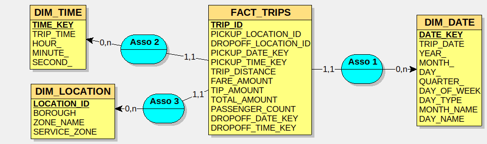
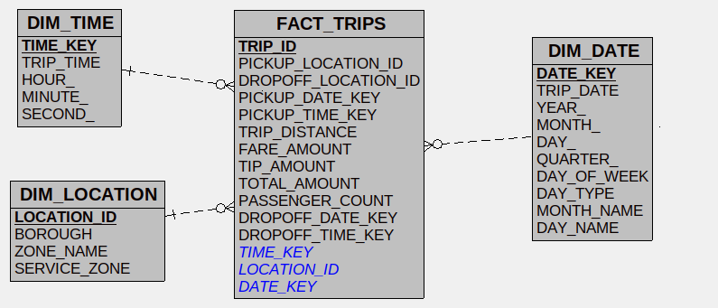
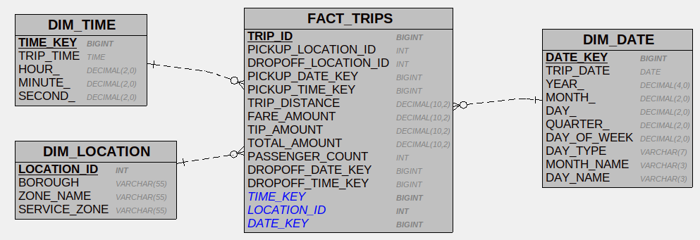

# 🏛️ Arquitectura

## 🏗️ Arquitectura Técnica

[]()
[]()
[]()
[]()

- **Orquestación**: GitHub Actions
- **Data Warehouse**: Snowflake
- **Transformación**: dbt
- **Lenguaje**: Python
<br>

## 📁 Estructura del Proyecto
```bash
nyc-taxi-pipeline/
├── .github/
│   ├── workflows/
│   │   ├── nyc_taxi_pipeline.yml
│   │   ├── codeql.yml
│   │   ├── python_code_tests.yml
│   │   ├── release.yml
│   │   └── sqlfluff.yml
│   │
│   └── dependabot.yml
│
├── docs/
│
├── snowflake_ingestion/
│   ├── init_data_warehouse.py
│   ├── scrape_links.py
│   ├── upload_stage.py
│   ├── load_to_table.py
│   │
│   ├── sql/
│   │   ├── init/
│   │   ├── scraping/
│   │   ├── stage/
│   │   └── load/
│   │
│   └── tests/
│
└── dbt_transformations/
    └── NYC_Taxi_dbt/
        └── models/
            ├── staging/
            ├── final/
            └── marts/
```

## 📊 Flujo de Procesamiento

### Pipeline Principal

**NYC Taxi Data Pipeline**
Pipeline de ingestión de datos ejecutado mensualmente:
<br>

1. **Inicialización de Infraestructura Snowflake**
   Inicialización de la infraestructura de Snowflake (base de datos, esquemas, warehouse, rol, usuario).
2. **Recolección de Enlaces**
   Web scraping y recuperación de enlaces de origen.
3. **Carga a Stage**
   Carga de archivos crudos al stage de Snowflake.
4. **Carga a Tabla**
   Carga de datos en la tabla del esquema RAW.
5. **Ejecución de Transformaciones dbt**
   Transformaciones dbt (STAGING luego FINAL).
6. **Ejecución de Pruebas dbt**
   Ejecución de pruebas dbt para validar los modelos.
7. **Política de Copias de Seguridad**  
   Configuración automática de políticas de respaldo para la base de datos, tabla RAW y esquema FINAL.
   
### Pipelines de Calidad

- **CodeQL Security Scan**
  Análisis estático del código Python usando CodeQL para detectar vulnerabilidades en cada push o pull request a `dev` y `main`.
- **Actualizaciones Dependabot**
  Actualizaciones automatizadas de dependencias de Python y GitHub Actions según un calendario trimestral.
- **pages-build-deployment**
  Implementación automática de la documentación del proyecto a través de GitHub Pages.
- **Pruebas de Código Python**
  Ejecución de pruebas unitarias Pytest en cada push o pull request a `dev` y `main`.
- **Release**
  Versionado automático, generación de changelog y publicación de releases mediante Python Semantic Release en cada push o pull request a `main`.
- **Calidad de Código SQL**
  Linting automático del código SQL (modelos dbt y scripts de Snowflake) con SQLFluff en cada push o pull request a `dev` y `main`.


## Modelado de Datos (Data Modeling)

Esta tabla documenta **cómo se almacenan los datos**.

| Nombre de la Tabla      | Esquema       | Tipo de Tabla | Materialización |
| :---------------------- | :------------ | :------------ | :-------------- |
| FILE_LOADING_METADATA   | `SCHEMA_RAW`  | Transitoria   | Tabla           |
| YELLOW_TAXI_TRIPS_RAW   | `SCHEMA_RAW`  | Permanente    | Incremental     |
| TAXI_ZONE_LOOKUP        | `SCHEMA_RAW`  | Permanente    | Tabla           |
| TAXI_ZONE_STG           | `SCHEMA_STAGING`  | Transitoria   | Tabla           |
| YELLOW_TAXI_TRIPS_STG   | `SCHEMA_STAGING`  | Transitoria   | Incremental     |
| int_trip_metrics        | `SCHEMA_STAGING`  |               | Vista           |
| fact_trips              | `SCHEMA_FINAL`| Permanente    | Incremental     |
| dim_locations           | `SCHEMA_FINAL`| Permanente    | Tabla           |
| dim_time                | `SCHEMA_FINAL`| Permanente    | Tabla           |
| dim_date                | `SCHEMA_FINAL`| Permanente    | Tabla           |
| marts                   | `SCHEMA_FINAL`|               | Vista           |

Detalles disponibles en la <a href="https://eliasmez.github.io/nyc-taxi-pipeline/dbt">📚 Documentación en línea de <strong>dbt</strong></a>

**Modelo Conceptual de Datos (MCD)**



**Modelo Lógico de Datos (MLD)**



**Modelo Físico de Datos (MPD)**


## 📐 Dimensiones de cambio lento (SCD)

Las 3 dimensiones son **SCD Tipo 0**: no se espera ninguna variación.

| Dimensión | Tipo SCD | Justificación |
|-----------|----------|---------------|
| `dim_date` | Tipo 0 | Los atributos de una fecha nunca cambian |
| `dim_time` | Tipo 0 | Los atributos de una hora nunca cambian |
| `dim_locations` | Tipo 0 | El referencial de zonas NYC TLC es estable |

Evoluciones posibles:

- Corrección de nombre de zona → **SCD Tipo 1** (sobrescritura sin historial)
- División de zona → **SCD Tipo 2** (nueva fila con `valid_from`, `valid_to`, `is_current`)
