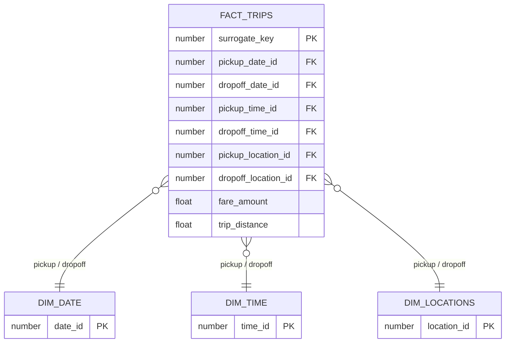

# 🏛️ Architecture

## 🏗️ Architecture Technique

[]()
[]()
[]()
[]()

- **Orchestration** : GitHub Actions
- **Data Warehouse** : Snowflake
- **Transformation** : dbt
- **Langage** : Python
<br>

## 📁 Structure du Projet
```bash
nyc-taxi-pipeline/
├── .github/
│ ├── workflows/
│ │ ├── nyc_taxi_pipeline.yml
│ │ ├── codeql.yml
│ │ ├── python_code_tests.yml
│ │ ├── release.yml
│ │ └── sqlfluff.yml
│ │
│ └── dependabot.yml
│
├── docs/
│
├── snowflake_ingestion/
│ ├── init_data_warehouse.py
│ ├── scrape_links.py
│ ├── upload_stage.py
│ ├── load_to_table.py
│ │
│ ├── sql/
│ │ ├── init/
│ │ ├── scraping/
│ │ ├── stage/
│ │ └── load/
│ │
│ └── tests/
│
└── dbt_transformations/
  └── NYC_Taxi_dbt/
    └── models/
      ├── staging/
      ├── final/
      └── marts/
```

## 📊 Flux de traitement

### Pipeline Principal

**NYC Taxi Data Pipeline**  
Pipeline d'ingestion exécuté mensuellement :
<br>

1. **Snowflake Infra Init**  
   Initialisation de l'infrastructure Snowflake (base, schémas, warehouse, rôle, utilisateur).
2. **Scrape Links**  
   Scraping et récupération des liens sources.
3. **Upload to Stage**  
   Upload des fichiers bruts dans le stage Snowflake.
4. **Load to Table**  
   Chargement des données dans la table du schéma RAW.
5. **Run dbt Transformations**  
   Transformations dbt (STAGING puis FINAL).
6. **Run dbt Tests**  
   Exécution des tests dbt pour valider les modèles.
7. **Backup Policy**  
   Configuration automatique des politiques de sauvegarde pour la base, table RAW et schéma FINAL.
   
### Pipelines Qualité

- **CodeQL Security Scan** <br> Analyse statique du code Python à l’aide de CodeQL afin de détecter des vulnérabilités sur chaque push ou pull request vers `dev` et `main`.
- **Dependabot Updates** <br> Mises à jour automatisées des dépendances Python et GitHub Actions selon une planification trimestrielle.
- **pages-build-deployment** <br> Déploiement automatique de la documentation du projet via GitHub Pages.
- **Python Code Tests** <br> Exécution des tests unitaires Pytest sur chaque push ou pull request vers `dev` et `main`.
- **Release** <br> Versioning automatique, génération du changelog et publication des releases via Python Semantic Release sur chaque push ou pull request vers `main`.
- **SQL Code Quality** <br> Linting automatique du code SQL (modèles dbt et scripts Snowflake) avec SQLFluff sur chaque push ou pull request vers `dev` et `main`.


## Modélisation des Données

Le tableau documente **comment les données sont stockées**.

| Nom de la table         | Schéma        | Type de table | Matérialisation |
| :---------------------- | :------------ | :------------ | :-------------- |
| FILE_LOADING_METADATA   | `SCHEMA_RAW`  | Transitoire   | Table           |
| YELLOW_TAXI_TRIPS_RAW   | `SCHEMA_RAW`  | Permanente    | Incremental     |
| TAXI_ZONE_LOOKUP        | `SCHEMA_RAW`  | Permanente    | Table           |
| TAXI_ZONE_STG           | `SCHEMA_STAGING`  | Transitoire   | Table           |
| YELLOW_TAXI_TRIPS_STG   | `SCHEMA_STAGING`  | Transitoire   | Incremental     |
| int_trip_metrics        | `SCHEMA_STAGING`  |               | Vue             |
| fact_trips              | `SCHEMA_FINAL`| Permanente    | Incremental     |
| dim_locations           | `SCHEMA_FINAL`| Permanente    | Table           |
| dim_time                | `SCHEMA_FINAL`| Permanente    | Table           |
| dim_date                | `SCHEMA_FINAL`| Permanente    | Table           |
| marts                   | `SCHEMA_FINAL`|               | Vue             |

details disponibles dans la <a href="https://eliasmez.github.io/nyc-taxi-pipeline/dbt">📚 Documentation <strong>dbt</strong> en ligne</a>

**Schéma en étoile (ERD)**



## 📐 Gestion des dimensions lentes (SCD)

Les 3 dimensions sont en **SCD Type 0** : aucune variation n'est attendue.

| Dimension | Type SCD | Justification |
|-----------|----------|---------------|
| `dim_date` | Type 0 | Les attributs d'une date ne changent jamais |
| `dim_time` | Type 0 | Les attributs d'une heure ne changent jamais |
| `dim_locations` | Type 0 | Le référentiel des zones NYC TLC est stable |

Évolutions possibles :

- Correction de nom de zone → **SCD Type 1** (écrasement sans historisation)
- Scission de zone → **SCD Type 2** (nouvelle ligne avec `valid_from`, `valid_to`, `is_current`)
